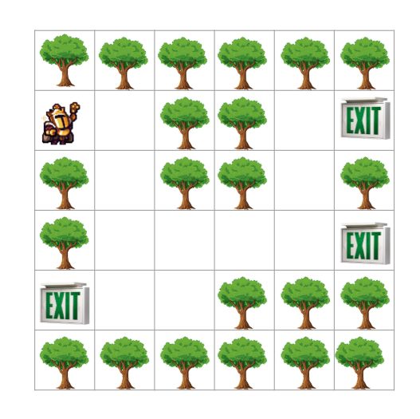
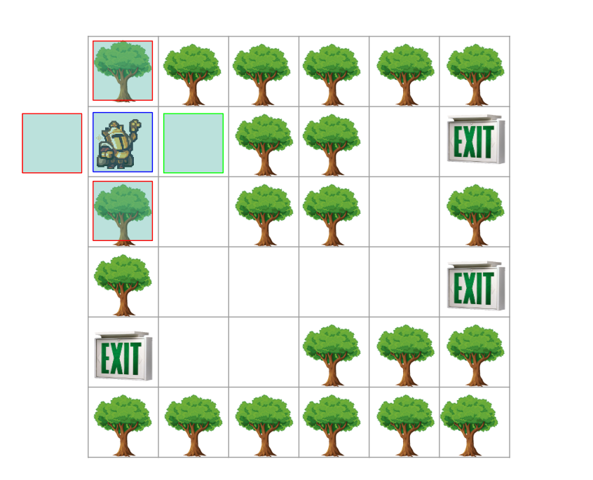
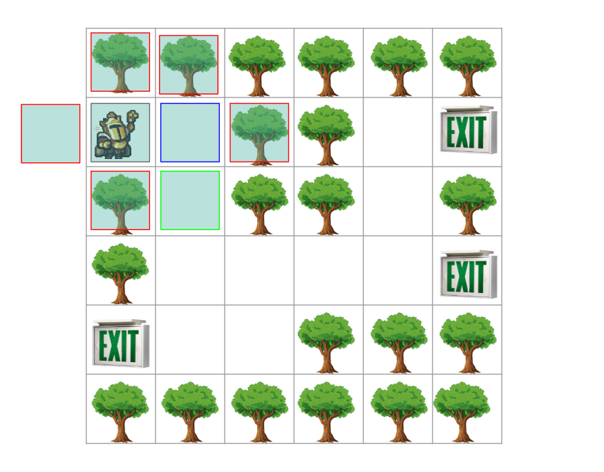
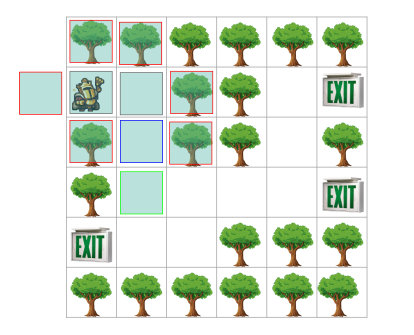
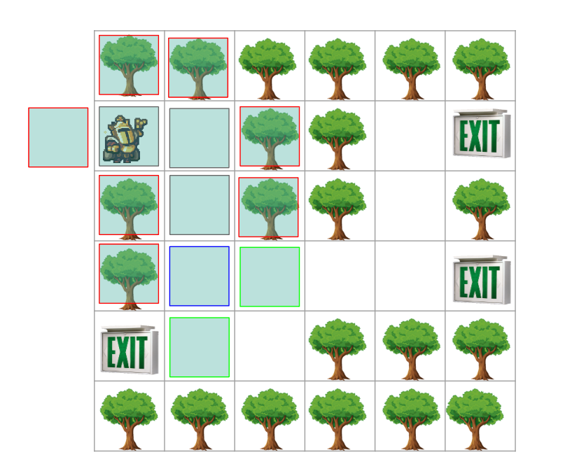
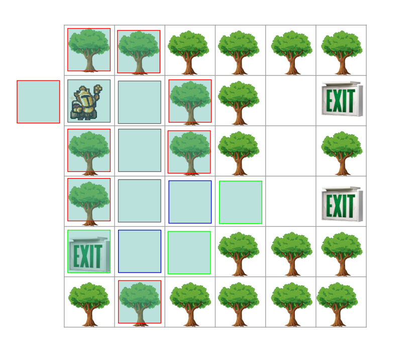

# Troubling Traversals Part 3 Explanation

## Topics

- Array
- Matrix
- Breadth-First Search

## Question

The party of adventurers are trying to navigate through a forest. They use a recon bird to get an overview of each exit.
You are tasked with finding the shortest path to an exit given the rules:

- You can only move up, down, left, right
- You cannot move through trees (1s)

Given an 2D integer array *f* that has 0 as an open path, 1 as a tree, and 2 as a valid exit, 3 as the start, return the coordinates of the shortest path to an exit as a string.
If no path is found, return an empty string.

## Approach

When it comes to matrix traversal, you generally use 2 sorts of algorithms: Breadth-First Search (BFS) and Depth-First Search (DFS).

We want to use BFS here to solve this problem.
Why? Because we want to find the shortest path. With these constraints, BFS will always find the shortest path.
Why is this the case? Because BFS explores all nodes at the present depth prior to moving on to the nodes at the next depth level.

Given the test case:

```java
f = [
  [1, 1, 1, 1, 1, 1],
  [3, 0, 1, 1, 0, 2],
  [1, 0, 1, 1, 0, 1],
  [1, 0, 0, 0, 0, 2],
  [2, 0, 0, 1, 1, 1],
  [1, 1, 1, 1, 1, 1]
]
```

Can be visualized as:



Typically when starting BFS, you need a couple of things:

- A queue to keep track of the current position
- A visited array to keep track of the positions we have visited
- A directions array to keep track of the possible directions we can move in

```java
int[] directions = {0, 1, 0, -1, 1, 0, -1, 0};

int rows = f.length;
int cols = f[0].length;
boolean[][] visited = new boolean[rows][cols];
Queue<int[]> queue = new LinkedList<>();
```

Then you should find the starting position to insert into the queue.
This will be the first BFS check.

```java
for (int i = 0; i < rows; i++) {
    for (int j = 0; j < cols; j++) {
        if (f[i][j] == 3) {
            queue.add(new int[]{i, j});
            visited[i][j] = true;
            break;
        }
    }
}
```

Now that the queue has been initialized, and the starting position has been inserted into the queue, you can start a BFS check.

```java
while (!queue.isEmpty()) {
    int[] current = queue.poll();
    int x = current[0];
    int y = current[1];

    if (f[x][y] == 2) {
        return (x + 1) + "," + (y + 1);
    }

    for (int i = 0; i < 4; i++) {
        int nx = x + directions[i];
        int ny = y + directions[i + 1];

        if (nx >= 0 && nx < rows && ny >= 0 && ny < cols && !visited[nx][ny] && f[nx][ny] != 1) {
            queue.add(new int[]{nx, ny});
            visited[nx][ny] = true;
        }
    }
}
```

This visualization shows the BFS check in action. Your implementation should be similar to this.



Blue squares are the current positions that are being checked.

Red squares are an invalid move. It is either out of bounds or it is a tree.

Grey squares are the positions that have already been visited.

Green squares are a valid move. It is within bounds, not a tree, and not visited.

Here is the rest of the BFS checks and the final result:









Then during that last check, it marks an exit and adds it to the queue.
When it's processed, it notices that the exit has been reached and returns the coordinates.

## Complexity

The time complexity is O(n * m) where n is the number of rows and m is the number of columns.

The space complexity is O(n * m) where n is the number of rows and m is the number of columns.

## Code

```java
int[] directions = {0, 1, 0, -1, 1, 0, -1, 0};
int rows = f.length;
int cols = f[0].length;

boolean[][] visited = new boolean[rows][cols];
Queue<int[]> queue = new LinkedList<>();

for (int i = 0; i < rows; i++) {
    for (int j = 0; j < cols; j++) {
        if (f[i][j] == 3) {
            queue.add(new int[]{i, j});
            visited[i][j] = true;
            break;
        }
    }
}

while (!queue.isEmpty()) {
    int[] current = queue.poll();
    int x = current[0];
    int y = current[1];

    if (f[x][y] == 2) {
        return (x + 1) + "," + (y + 1);
    }

    for (int i = 0; i < 4; i++) {
        int nx = x + directions[i];
        int ny = y + directions[i + 1];

        if (nx >= 0 && nx < rows && ny >= 0 && ny < cols && !visited[nx][ny] && f[nx][ny] != 1) {
            queue.add(new int[]{nx, ny});
            visited[nx][ny] = true;
        }
    }
}

return "";
```

Input:

```java
f = [
    [1, 1, 1, 1, 1, 1],
    [3, 0, 1, 1, 0, 2],
    [1, 0, 1, 1, 0, 1],
    [1, 0, 0, 0, 0, 2],
    [2, 0, 0, 1, 1, 1],
    [1, 1, 1, 1, 1, 1]
]
```

Output:

```java
"4,0"
```
